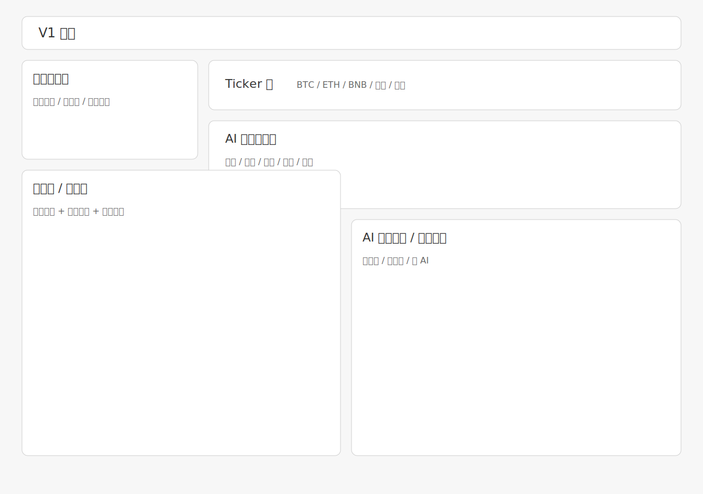
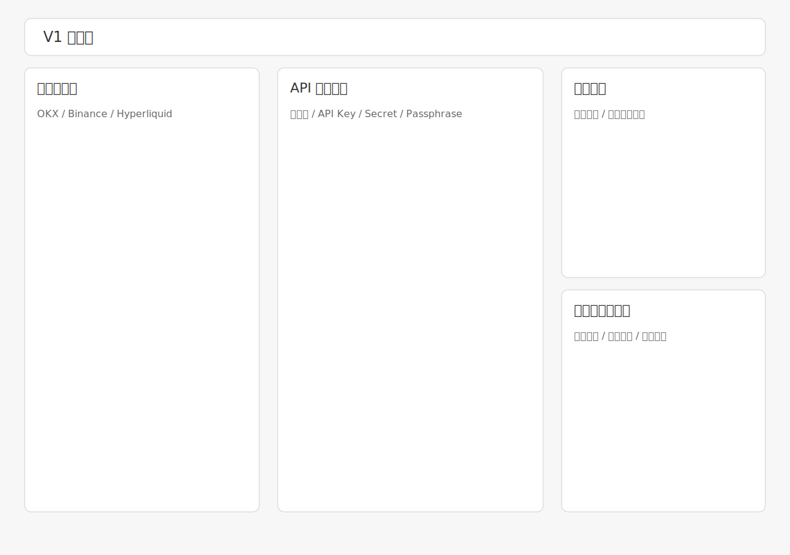
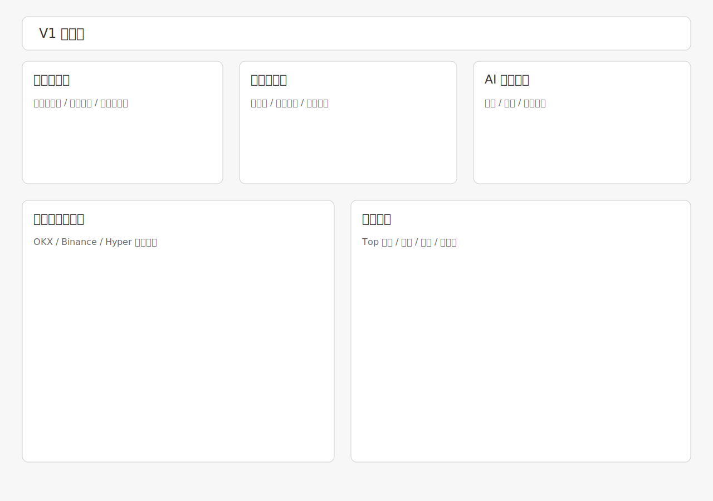
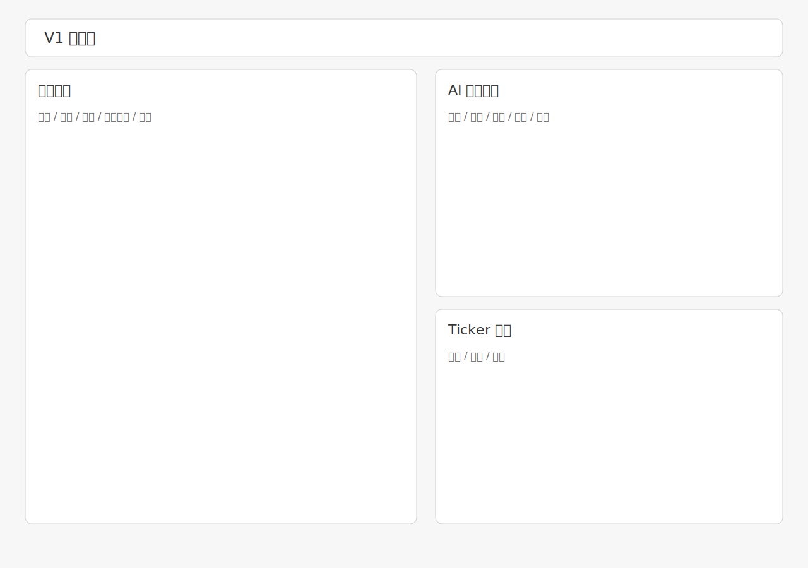
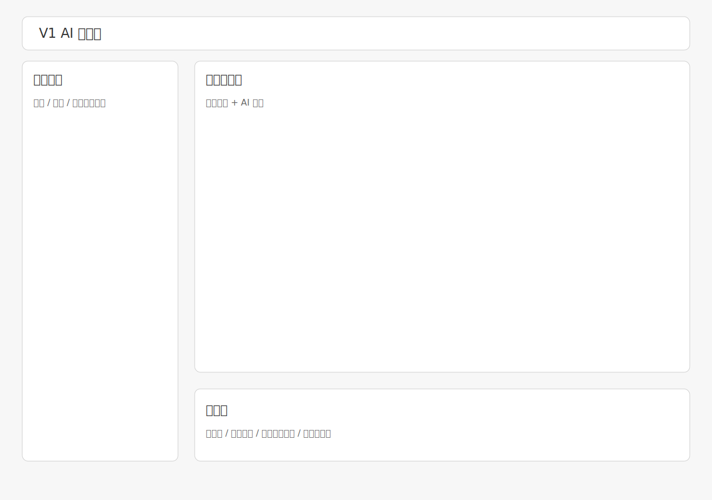

# 知道 AI 交易产品 V1 PRD

## 1. 文档信息

| 项目 | 内容 |
|---|---|
| 产品名称 | 知道 AI 交易产品 |
| 版本 | V1 |
| 文档类型 | 产品需求文档 PRD |
| 文档日期 | 2026-04-14 |
| 产品阶段 | V1 Feature 定义版 |
| 文档目的 | 对齐产品范围、页面结构、字段、交互、接口与验收标准 |

## 2. 背景与目标

### 2.1 背景

当前产品已经具备首页、授权页、账户页、快讯页、对话页、交易页等原型页面，但功能点分散在多个 HTML 中，缺少一份以 V1 Feature List 为核心的统一 PRD，用于指导设计收敛、研发排期和联调验收。

### 2.2 V1 核心目标

V1 聚焦三件事：

1. 用户能安全、顺畅地完成 OKX / 币安 / Hyper API 授权接入。
2. 用户接入后，能够快速看到账户状态、持仓、成交和 AI 风险/机会提示。
3. 用户能够从首页与快讯页进入 AI 对话和交易判断闭环。

### 2.3 目标用户

| 用户类型 | 特征 | 核心诉求 |
|---|---|---|
| 已有交易账户的加密用户 | 使用 OKX / 币安 / Hyperliquid | 快速接入账户并查看资产与持仓 |
| 高频看盘用户 | 频繁关注新闻、价格和机会 | 在一个入口里看到资讯、行情、AI 结论 |
| AI 辅助决策用户 | 想知道“为什么涨跌、该关注什么” | 希望 AI 给出解释、评分和建议 |

### 2.4 V1 不包含

| 项目 | 说明 |
|---|---|
| 真实下单与真实关仓执行 | 本版以展示、模拟、引导为主 |
| 完整策略引擎和自动化交易 | 不在 V1 范围 |
| 多账户权限体系 / 团队协作 | 不在 V1 范围 |
| 复杂风控编排与通知中心 | V1 仅做基础提示 |

## 3. V1 Feature List

以下内容按你提供的 V1 Feature List 收敛为正式需求：

| 模块 | Feature | 对应页面 | 说明 | 优先级 |
|---|---|---|---|---|
| 页面结构 | 导航统一 | 全页面 | 保证主链路跳转一致 | P0 |
| 授权 API | OKX / 币安 / Hyper API 授权接入 | `authorize.html` | 支持 API Key / Secret / Passphrase 输入 | P0 |
| 授权 | API 授权校验 | `authorize.html` | 校验 API 是否可用、权限是否正确 | P0 |
| 授权 | 模拟盘 / 实盘识别 | `authorize.html` / `account.html` | 降低用户误操作风险 | P0 |
| 授权 | 授权风险提示 | `authorize.html` | 展示 API 权限和账户安全说明 | P0 |
| 授权 | OKX / 币安 快捷授权入口 | `authorize.html` | 支持快捷授权方式接入 | P0 |
| 账户 | 账户资产概览 | `account.html` | 展示余额、权益、连接状态 | P0 |
| 账户 | 资产收益 | `account.html` | 总资产 / 可用余额 / 账户结构 | P1 |
| 账户 | 授权 | `account.html` | 交易所链接状态 | P1 |
| 账户 | AI 账户评分 | `account.html` | 持仓评分 / AI 评价 | P1 |
| 账户 | 最近成交 | `account.html` | 最近成交记录 | P0 |
| 账户 | 持仓 | `account.html` | 持仓，可手动操作止盈止损和关仓 | P0 |
| 首页 | 账户摘要卡片 | `index.html` | 首页一眼看到账户是否已接入 | P0 |
| 首页 | 持仓预览摘要 | `index.html` | 首页展示核心仓位概况 | P1 |
| 资讯 | 新闻资讯 | `index.html` | 快讯接入 | P1 |
| 资讯 | AI 资产关联 | `fast.html` | AI 关联资产 / 利多利空标签 / AI 给出原因 | P1 |
| 资讯 | 币价 | `fast.html` | 关联资产 24h 涨跌幅 / 24h 最高 / 24h 最低 / 24h 成交额 / 当前价格 | P1 |
| AI | AI 账户评分 | `fast.html` / 子视图 | AI 对持仓进行评分 | P0 |
| 持仓资产 | AI 分析 | `fast.html` / 子视图 | 持仓信息显示，并给出当日一句话评价 | P1 |
| 热点方块图 | 分类数据 | `fast.html` / 子视图 | 数据中台获取该信息 | P2 |
| AI | 交易机会 | `fast.html` / 发现子视图 | 获取 fast 页面中的资产进行滚动显示，并显示总数 | P1 |
| 事件日历 | 今天 / 近7日 | `fast.html` / 发现子视图 | 数据中台获取该信息 | P1 |
| AI | 对话 | `index.html` / `trade.html` | API 接入 chatbot | P0 |
| 交易 | 实时数据 | `index.html` | 实时资产数据展示，无交易无 AI 分析 | P0 |

## 4. 产品信息架构

### 4.1 全局信息架构

```text
知道 AI
|- 首页 index.html
|  |- 顶部导航
|  |- 左侧统一功能导航
|  |- 账户摘要卡片
|  |- 实时行情与资产数据
|  |- 新闻/发现流
|  |- AI 账户评分
|  |- AI 热点方块图
|  |- AI 交易机会
|  |- 关键事件日历
|  |- AI 对话入口
|
|- 授权页 authorize.html
|  |- 交易所授权列表
|  |- 快捷授权入口
|  |- API 授权弹窗
|  |- API 校验结果
|  |- 模拟盘/实盘识别
|  |- 风险提示与教程
|
|- 账户页 account.html
|  |- 账户总览
|  |- 总权益/可用余额/账户结构
|  |- 交易所连接状态
|  |- AI 账户评分
|  |- 最近成交
|  |- 持仓管理
|
|- 快讯页 fast.html
|  |- 市场快讯列表
|  |- AI 深度解读
|  |- 关联资产与情绪标签
|  |- 账户评分侧栏
|  |- 热点方块图
|  |- AI 交易机会
|  |- 关键事件日历
|
|- 对话页 chat.html / index.html 对话视图
|  |- 对话入口列表
|  |- 历史对话
|  |- 输入框
|  |- 推荐问题 / 快捷能力入口
|
|- 交易页 trade.html
   |- 实时行情
   |- AI 分析侧栏
   |- 聊天 / 提问入口
   |- 交易动作承接区
```

### 4.2 导航与主链路

| 起点 | 关键动作 | 去向 | 目标 |
|---|---|---|---|
| 首页 | 点击“去授权” | 授权页 | 完成账户接入 |
| 授权页 | 授权成功 | 账户页 | 查看资产与连接状态 |
| 首页 / 快讯页 | 点击 AI 观点 / 问 AI | 对话页 | 继续追问和解释 |
| 快讯页 | 点击“去交易” | 交易页 | 查看对应资产和机会 |
| 账户页 | 点击“管理授权” | 授权页 | 维护 API 接入 |

### 4.3 页面结构规范

| 规范项 | 说明 |
|---|---|
| 顶部导航 | 所有主页面均显示页标题、返回首页或品牌标识 |
| 左侧侧边栏 | 统一包含发现 / 对话 / 交易 / AI诊断 / 授权 / 账户 |
| 状态标签 | 涉及授权、评分、连接状态、模拟盘时必须使用明显标签 |
| 主 CTA | 每页至少保留一个主路径按钮，如去授权、去交易、问 AI |

## 5. 页面清单

| 页面 | 路径 | 页面角色 | 当前原型 |
|---|---|---|---|
| 首页 | `/index.html` | 聚合账户、资讯、AI、行情的统一入口 | [index.html](/Users/kt/文档/task/zhidao/index.html) |
| 授权页 | `/authorize.html` | API 授权接入与风险提示 | [authorize.html](/Users/kt/文档/task/zhidao/authorize.html) |
| 账户页 | `/account.html` | 账户资产、连接状态、成交与持仓管理 | [account.html](/Users/kt/文档/task/zhidao/account.html) |
| 快讯页 | `/fast.html` | 市场快讯、AI 解读、机会与日历 | [fast.html](/Users/kt/文档/task/zhidao/fast.html) |
| 对话页 | `/chat.html` | AI 对话工作区 | [chat.html](/Users/kt/文档/task/zhidao/chat.html) |
| 交易页 | `/trade.html` | 实时行情与交易承接页 | [trade.html](/Users/kt/文档/task/zhidao/trade.html) |

## 6. 页面截图

说明：

1. 当前仓库已沉淀真实 HTML 原型页面。
2. PRD 中保留线框截图用于结构说明，便于产品、设计、研发统一理解。
3. 每个截图下方补充对应的真实原型页面链接，便于直接打开查看。

### 6.1 首页截图



原型参考：[index.html](/Users/kt/文档/task/zhidao/index.html)

### 6.2 授权页截图



原型参考：[authorize.html](/Users/kt/文档/task/zhidao/authorize.html)

### 6.3 账户页截图



原型参考：[account.html](/Users/kt/文档/task/zhidao/account.html)

### 6.4 快讯页截图



原型参考：[fast.html](/Users/kt/文档/task/zhidao/fast.html)

### 6.5 AI 对话页截图



原型参考：[chat.html](/Users/kt/文档/task/zhidao/chat.html)

## 7. 页面详细需求

## 7.1 首页 `index.html`

### 7.1.1 页面目标

首页是 V1 的统一入口，承接四类核心问题：

1. 用户是否已授权并连接账户。
2. 当前账户和持仓是否健康。
3. 当前市场是否存在值得关注的新闻和机会。
4. 用户是否要进一步进入 AI 对话或交易页。

### 7.1.2 页面模块

| 模块 | 优先级 | 说明 |
|---|---|---|
| 顶部导航 | P0 | 返回、页签标题、品牌标识 |
| 左侧统一导航 | P0 | 跨页面跳转统一 |
| 首页账户摘要卡片 | P0 | 一眼看到是否已接入账户 |
| 实时资产数据 | P0 | 展示实时价格、涨跌、成交额等 |
| 持仓预览摘要 | P1 | 展示核心持仓或关注资产 |
| 新闻资讯 | P1 | 展示快讯流和摘要 |
| AI 对话入口 | P0 | 进入聊天或带上下文发问 |
| AI 账户评分 | P0 | 展示账户健康度 |
| 热点方块图 | P2 | 分类热度和涨跌概览 |
| AI 交易机会 | P1 | 聚合机会卡片 |
| 关键事件日历 | P1 | 今天 / 近 7 日事件 |

### 7.1.3 字段表

| 字段名 | 类型 | 必填 | 来源 | 说明 |
|---|---|---|---|---|
| `accountConnected` | boolean | 是 | 授权状态 | 是否已连接任一账户 |
| `defaultExchange` | string | 否 | 授权状态 | 默认交易所名称 |
| `accountStatus` | enum | 是 | 账户状态 | `connected / disconnected / simulated / error` |
| `totalEquity` | number | 否 | 账户接口 | 总权益，USDT |
| `availableBalance` | number | 否 | 账户接口 | 可用余额 |
| `positionPreviewList` | array | 否 | 持仓接口 | 首页摘要展示的持仓列表 |
| `tickerList` | array | 是 | 行情接口 | 实时资产数据列表 |
| `assetSymbol` | string | 是 | 行情接口 | 资产代码 |
| `lastPrice` | number | 是 | 行情接口 | 当前价格 |
| `change24h` | number | 是 | 行情接口 | 24h 涨跌幅 |
| `volume24h` | number | 否 | 行情接口 | 24h 成交额 |
| `newsFeed` | array | 否 | 新闻接口 | 首页快讯流 |
| `portfolioScore` | number | 否 | AI 服务 | 账户健康度评分 |
| `tradeIdeas` | array | 否 | AI 服务 | AI 交易机会 |
| `calendarEvents` | array | 否 | 数据中台 | 关键事件列表 |

### 7.1.4 关键交互

| 编号 | 交互 | 触发条件 | 系统行为 |
|---|---|---|---|
| H-01 | 点击去授权 | 未授权状态 | 跳转授权页 |
| H-02 | 点击账户摘要卡 | 已连接账户 | 跳转账户页 |
| H-03 | 点击快讯卡 | 快讯存在详情 | 打开详情或跳快讯页 |
| H-04 | 点击 AI 机会卡 | 用户点击机会 | 跳转交易页并带资产上下文 |
| H-05 | 点击问 AI | 用户发起提问 | 进入对话页 |
| H-06 | 页面轮询刷新 | 页面停留中 | 刷新行情、评分、事件数据 |

### 7.1.5 页面状态

| 状态 | 展示规则 |
|---|---|
| 未授权 | 首页显示授权 CTA，不显示真实资产值 |
| 已授权但无持仓 | 显示账户已连接与空仓说明 |
| 接口异常 | 行情或账户区显示错误提示与重试 |
| 模拟盘 | 页面显著标记“模拟盘” |

## 7.2 授权页 `authorize.html`

### 7.2.1 页面目标

帮助用户完成 OKX / 币安 / Hyper 的接入，支持快捷授权与 API 授权两种方式，并提供风险提示、教程和校验反馈。

### 7.2.2 页面模块

| 模块 | 优先级 | 说明 |
|---|---|---|
| 交易所授权列表 | P0 | 展示支持的交易所和接入方式 |
| 快捷授权入口 | P0 | OKX / 币安支持快捷接入 |
| API 授权表单 | P0 | 填写 API Key / Secret / Passphrase |
| API 校验结果区 | P0 | 返回可用性和权限检查结果 |
| 模拟盘 / 实盘识别 | P0 | 识别环境，避免误操作 |
| 风险提示区 | P0 | 提醒不要开启提币权限等 |
| 授权教程区 | P0 | 分交易所展示操作步骤 |

### 7.2.3 字段表

| 字段名 | 类型 | 必填 | 来源 | 说明 |
|---|---|---|---|---|
| `exchange` | enum | 是 | 用户选择 | `okx / binance / hyper` |
| `authMode` | enum | 是 | 用户选择 | `quick / api` |
| `remarkName` | string | 否 | 用户输入 | 授权备注名 |
| `apiKey` | string | 视模式 | 用户输入 | API Key |
| `apiSecret` | string | 视模式 | 用户输入 | API Secret |
| `passphrase` | string | 视模式 | 用户输入 | OKX Passphrase 或兼容字段 |
| `walletAddress` | string | Hyper 场景 | 用户输入 | Hyper 地址 |
| `privateKey` | string | Hyper 场景 | 用户输入 | Hyper 私钥 |
| `isDefault` | boolean | 否 | 用户输入 | 是否设为默认账户 |
| `bindAccount` | boolean | 否 | 用户输入 | 是否绑定到账户中心 |
| `envType` | enum | 否 | 校验接口 | `live / simulated / unknown` |
| `permissionRead` | boolean | 否 | 校验接口 | 是否具备读取权限 |
| `permissionTrade` | boolean | 否 | 校验接口 | 是否具备交易权限 |
| `permissionWithdraw` | boolean | 否 | 校验接口 | 是否具备提币权限 |
| `validateStatus` | enum | 否 | 校验接口 | `success / fail / limited / timeout` |
| `validateMessage` | string | 否 | 校验接口 | 校验结果说明 |

### 7.2.4 校验规则

| 规则 | 说明 |
|---|---|
| 交易所必填 | 未选择交易所不能提交 |
| 授权方式必填 | 未选择快捷授权或 API 授权不能提交 |
| API 模式字段校验 | API Key / Secret / Passphrase 按交易所规则必填 |
| Hyper 字段适配 | Hyper 文案与字段命名独立展示 |
| 权限安全规则 | 若检测到提币权限，必须高亮风险提示 |
| 环境识别规则 | 如果识别为模拟盘，需要高亮标识 |

### 7.2.5 关键交互

| 编号 | 交互 | 触发条件 | 系统行为 |
|---|---|---|---|
| A-01 | 切换交易所 | 点击交易所项 | 切换教程与表单字段 |
| A-02 | 点击快捷授权 | 选定 OKX / 币安 | 打开快捷授权弹窗或外部流程 |
| A-03 | 点击 API 授权 | 用户进入 API 模式 | 打开授权表单 |
| A-04 | 提交授权 | 点击“添加授权” | 调用授权校验接口 |
| A-05 | 校验成功 | 返回成功 | 存储授权记录并提示跳转账户页 |
| A-06 | 校验失败 | 返回失败 | 展示失败原因 |
| A-07 | 风险提示确认 | 检测到高风险权限 | 强提醒后允许用户返回修改 |

### 7.2.6 页面状态

| 状态 | 展示规则 |
|---|---|
| 未填写 | 提交按钮禁用或点击后提示必填项 |
| 校验中 | 按钮 loading，禁止重复提交 |
| 校验成功 | 显示成功状态、环境识别、权限结果 |
| 校验失败 | 显示失败原因和重试入口 |

## 7.3 账户页 `account.html`

### 7.3.1 页面目标

账户页是授权后的核心状态页，用来回答：

1. 已接入哪些交易所。
2. 当前总权益、可用余额、账户结构如何。
3. 最近成交和持仓情况如何。
4. AI 对当前账户健康度的判断是什么。

### 7.3.2 页面模块

| 模块 | 优先级 | 说明 |
|---|---|---|
| 账户总览 Hero | P0 | 展示页面标题、环境、更新时间、去授权入口 |
| 资产概览卡 | P0 | 总权益、可用余额、现金余额 |
| 账户结构卡 | P1 | 总持仓价值、多空或结构占比 |
| 交易所连接状态 | P1 | OKX / 币安 / Hyper 接入状态 |
| AI 账户评分 | P1 | 分值、说明、风险/亮点摘要 |
| 最近成交记录 | P0 | 展示近期成交列表 |
| 持仓管理 | P0 | 持仓列表、止盈止损、关仓 |

### 7.3.3 字段表

| 字段名 | 类型 | 必填 | 来源 | 说明 |
|---|---|---|---|---|
| `totalEqUsd` | number | 否 | 账户接口 | 总权益 |
| `usdtAvail` | number | 否 | 账户接口 | 可用余额 |
| `usdtCash` | number | 否 | 账户接口 | 现金余额 |
| `positionExposureUsd` | number | 否 | 持仓接口 | 总仓位价值 |
| `exposureMix` | string | 否 | 持仓接口 | 仓位分布摘要 |
| `latestAccountTitle` | string | 否 | 授权记录 | 当前默认账户名称 |
| `envType` | enum | 否 | 授权 / 校验结果 | `live / simulated` |
| `connectionList` | array | 是 | 授权记录 | 交易所连接状态集合 |
| `exchangeName` | string | 是 | 授权记录 | 交易所名称 |
| `exchangeStatus` | enum | 是 | 授权记录 | `connected / pending / disconnected / error` |
| `exchangeMode` | enum | 否 | 授权记录 | `quick / api` |
| `accountScore` | number | 否 | AI 服务 | 健康度评分 0-100 |
| `accountScoreNotes` | array | 否 | AI 服务 | 评分说明列表 |
| `recentTrades` | array | 否 | 成交接口 | 最近成交记录 |
| `tradeTime` | datetime | 否 | 成交接口 | 成交时间 |
| `tradeSymbol` | string | 否 | 成交接口 | 资产代码 |
| `tradeSide` | enum | 否 | 成交接口 | `buy / sell` |
| `tradePrice` | number | 否 | 成交接口 | 成交价 |
| `tradeQty` | number | 否 | 成交接口 | 成交数量 |
| `positions` | array | 否 | 持仓接口 | 当前持仓列表 |
| `positionSymbol` | string | 否 | 持仓接口 | 资产代码 |
| `positionSide` | enum | 否 | 持仓接口 | `long / short` |
| `markPrice` | number | 否 | 持仓接口 | 标记价格 |
| `entryPrice` | number | 否 | 持仓接口 | 开仓价 |
| `pnl` | number | 否 | 持仓接口 | 浮动盈亏 |
| `takeProfit` | number | 否 | 用户输入 | 止盈价 |
| `stopLoss` | number | 否 | 用户输入 | 止损价 |

### 7.3.4 关键交互

| 编号 | 交互 | 触发条件 | 系统行为 |
|---|---|---|---|
| AC-01 | 页面初始化 | 打开账户页 | 读取授权记录和账户数据 |
| AC-02 | 点击刷新数据 | 点击刷新按钮 | 刷新资产、成交、持仓、评分 |
| AC-03 | 切换“最近成交记录”Tab | 点击 Tab | 展示成交列表 |
| AC-04 | 切换“持仓”Tab | 点击 Tab | 展示持仓管理卡 |
| AC-05 | 修改止盈 / 止损 | 输入 TP / SL | 先保存本地草稿 |
| AC-06 | 点击保存 | 持仓卡内点击保存 | 提示保存成功 |
| AC-07 | 点击关仓 | 持仓卡内点击关仓 | 执行本地模拟关仓并刷新数据 |
| AC-08 | 点击管理授权 | 用户要维护 API | 跳转授权页 |

### 7.3.5 页面状态

| 状态 | 展示规则 |
|---|---|
| 无授权记录 | 显示默认模拟账户引导去授权 |
| 已授权 | 展示当前授权交易所和默认账户 |
| 模拟盘 | 环境标签明确显示模拟盘 |
| 无持仓 | 持仓区显示空状态 |
| 数据失败 | 分模块显示失败提示，不阻断整页 |

## 7.4 快讯页 `fast.html`

### 7.4.1 页面目标

快讯页用于把新闻、价格、AI 解读和机会发现放在一个页面中，帮助用户快速扫市场并定位可交易资产。

### 7.4.2 页面模块

| 模块 | 优先级 | 说明 |
|---|---|---|
| 市场快讯列表 | P1 | 时间流形式展示快讯 |
| AI 深度解读卡 | P1 | 给出新闻的 AI 摘要和原因 |
| 资产关联与情绪标签 | P1 | 利多/利空/中性标签与关联资产 |
| 资产价格信息 | P1 | 当前价格、24h 涨跌、24h 高低、成交额 |
| AI 账户评分 | P0 | 侧栏展示账户健康度 |
| 持仓资产 AI 分析 | P1 | 对持仓资产给出一句话评价 |
| 热点方块图 | P2 | 分类热度视图 |
| AI 交易机会 | P1 | 滚动/列表展示交易机会与总数 |
| 关键事件日历 | P1 | 今天 / 近 7 日事件 |

### 7.4.3 字段表

#### A. 快讯主列表字段

| 字段名 | 类型 | 必填 | 来源 | 说明 |
|---|---|---|---|---|
| `newsId` | string | 是 | 资讯接口 | 快讯唯一 ID |
| `publishTime` | datetime | 是 | 资讯接口 | 发布时间 |
| `source` | string | 否 | 资讯接口 | 来源，如 Reuters |
| `category` | string | 否 | 资讯接口 | 宏观 / 加密 / AI 科技等 |
| `title` | string | 是 | 资讯接口 | 快讯标题 |
| `summary` | string | 否 | AI 服务 | AI 摘要 |
| `sentimentTag` | enum | 否 | AI 服务 | `bullish / bearish / neutral` |
| `relatedAssets` | array | 否 | AI 服务 | 关联资产列表 |
| `reasonText` | string | 否 | AI 服务 | 给出该资产的原因 |
| `actionHint` | string | 否 | AI 服务 | 一句话建议 |

#### B. 关联资产价格字段

| 字段名 | 类型 | 必填 | 来源 | 说明 |
|---|---|---|---|---|
| `symbol` | string | 是 | 行情接口 | 资产代码 |
| `currentPrice` | number | 是 | 行情接口 | 当前价格 |
| `change24h` | number | 是 | 行情接口 | 24h 涨跌幅 |
| `high24h` | number | 否 | 行情接口 | 24h 最高 |
| `low24h` | number | 否 | 行情接口 | 24h 最低 |
| `volume24h` | number | 否 | 行情接口 | 24h 成交额 |
| `aiScore` | number | 否 | AI 服务 | 关联资产评分 |

#### C. 右侧分析区字段

| 字段名 | 类型 | 必填 | 来源 | 说明 |
|---|---|---|---|---|
| `portfolioScore` | number | 否 | AI 服务 | AI 账户评分 |
| `portfolioComment` | string | 否 | AI 服务 | 账户健康度说明 |
| `holdingAnalysisList` | array | 否 | AI 服务 | 持仓资产分析列表 |
| `hotspotMap` | array | 否 | 数据中台 | 热点分类及涨跌 |
| `tradeIdeaList` | array | 否 | AI 服务 | 交易机会列表 |
| `tradeIdeaCount` | number | 否 | AI 服务 | 交易机会总数 |
| `calendarRange` | enum | 否 | 用户选择 | `today / seven_days` |
| `calendarEvents` | array | 否 | 数据中台 | 事件列表 |

### 7.4.4 关键交互

| 编号 | 交互 | 触发条件 | 系统行为 |
|---|---|---|---|
| F-01 | 点击快讯卡片 | 用户点击快讯 | 展开 AI 深度解读 |
| F-02 | 点击关联资产 | 用户点击资产标签 | 跳交易页或过滤相关新闻 |
| F-03 | 点击“去交易” | 存在推荐资产 | 跳转交易页 |
| F-04 | 点击“返回对话” | 用户要追问 | 跳转对话页并带上下文 |
| F-05 | 切换日历范围 | 点击今天 / 近7天 | 刷新事件列表 |
| F-06 | 点击交易机会卡 | 用户点击机会卡 | 打开交易页对应资产 |

### 7.4.5 页面状态

| 状态 | 展示规则 |
|---|---|
| 无新闻 | 展示暂无快讯空状态 |
| 新闻加载中 | 列表 skeleton 或 loading |
| 无机会 | 交易机会区提示“等待更多信号” |
| 数据异常 | 某模块失败仅局部报错 |

## 7.5 AI 对话页 `chat.html` / `index.html` 对话视图

### 7.5.1 页面目标

承接用户自然语言提问，围绕账户、新闻、持仓和交易机会进行对话解释。

### 7.5.2 页面模块

| 模块 | 优先级 | 说明 |
|---|---|---|
| 对话入口列表 | P0 | AI 助手、资讯助手、AI盯盘等 |
| 对话历史区 | P0 | 展示历史会话 |
| 输入框 | P0 | 提问或搜索 |
| 麦克风 / 快捷入口 | P1 | 语音或多入口能力 |
| 推荐能力区 | P1 | 提供不同 AI 助手入口 |

### 7.5.3 字段表

| 字段名 | 类型 | 必填 | 来源 | 说明 |
|---|---|---|---|---|
| `sessionId` | string | 否 | 会话系统 | 会话 ID |
| `assistantType` | enum | 是 | 用户选择 | `general / news / monitor` |
| `messageText` | string | 是 | 用户输入 | 用户问题 |
| `contextType` | enum | 否 | 页面上下文 | `account / news / trade / none` |
| `contextPayload` | object | 否 | 页面上下文 | 上下文对象 |
| `replyText` | string | 否 | Chat API | AI 回答内容 |
| `followupList` | array | 否 | Chat API | 推荐追问 |

### 7.5.4 关键交互

| 编号 | 交互 | 触发条件 | 系统行为 |
|---|---|---|---|
| C-01 | 选择 AI 助手 | 点击助手卡 | 切换对话主题 |
| C-02 | 发送问题 | 回车或发送 | 调用 Chat API |
| C-03 | 带上下文进入 | 从快讯/交易/首页进入 | 自动挂载上下文 |
| C-04 | 对话失败 | Chat API 异常 | 显示失败提示并支持重试 |

## 7.6 交易页 `trade.html`

### 7.6.1 页面目标

交易页承接用户从首页、快讯页、AI 机会卡进入后的实时行情查看和进一步提问需求。本版不要求真实下单闭环，但要完成“看行情 + 看 AI + 继续问”的链路。

### 7.6.2 页面模块

| 模块 | 优先级 | 说明 |
|---|---|---|
| 实时价格区 | P0 | 当前价格、涨跌、K 线或图表 |
| 标的切换区 | P0 | BTC / ETH / 其他关注标的 |
| AI 分析面板 | P0 | 输出趋势、风险、建议 |
| 聊天入口 | P0 | 对当前标的继续提问 |
| 交易动作承接区 | P1 | 展示买入/卖出意图承接，不做真实下单 |

### 7.6.3 字段表

| 字段名 | 类型 | 必填 | 来源 | 说明 |
|---|---|---|---|---|
| `symbol` | string | 是 | 页面参数 | 当前资产 |
| `markPrice` | number | 是 | 行情接口 | 当前价格 |
| `change24h` | number | 是 | 行情接口 | 24h 涨跌 |
| `high24h` | number | 否 | 行情接口 | 24h 最高 |
| `low24h` | number | 否 | 行情接口 | 24h 最低 |
| `volume24h` | number | 否 | 行情接口 | 24h 成交额 |
| `aiTrend` | enum | 否 | AI 服务 | `long / short / neutral` |
| `aiReason` | string | 否 | AI 服务 | 观点说明 |
| `chatPrompt` | string | 否 | 用户输入 | 用户追问内容 |

### 7.6.4 关键交互

| 编号 | 交互 | 触发条件 | 系统行为 |
|---|---|---|---|
| T-01 | 页面初始化 | 从首页/快讯页进入 | 加载对应标的行情 |
| T-02 | 切换标的 | 点击资产列表 | 刷新图表与 AI 分析 |
| T-03 | 点击 AI 建议 | 用户关注建议 | 展开说明 |
| T-04 | 点击聊天入口 | 用户要继续问 | 带当前标的跳 AI 对话 |

## 8. 数据与字段对象定义

### 8.1 授权对象 Authorization

| 字段 | 类型 | 说明 |
|---|---|---|
| `id` | string | 授权记录 ID |
| `exchange` | string | `okx / binance / hyper` |
| `mode` | string | `quick / api` |
| `remark` | string | 备注名 |
| `envType` | string | `live / simulated` |
| `permissions` | object | 权限集合 |
| `isDefault` | boolean | 是否默认账户 |
| `createdAt` | datetime | 创建时间 |

### 8.2 账户摘要对象 AccountSummary

| 字段 | 类型 | 说明 |
|---|---|---|
| `totalEqUsd` | number | 总权益 |
| `availableUsd` | number | 可用余额 |
| `cashUsd` | number | 现金余额 |
| `positionExposureUsd` | number | 仓位价值 |
| `status` | string | 账户状态 |
| `simulated` | boolean | 是否模拟盘 |
| `updatedAt` | datetime | 最近更新时间 |

### 8.3 持仓对象 Position

| 字段 | 类型 | 说明 |
|---|---|---|
| `symbol` | string | 资产代码 |
| `side` | string | `long / short` |
| `qty` | number | 数量 |
| `entryPrice` | number | 开仓价 |
| `markPrice` | number | 标记价 |
| `pnl` | number | 浮盈亏 |
| `leverage` | number | 杠杆 |
| `tp` | number | 止盈价 |
| `sl` | number | 止损价 |

### 8.4 新闻对象 NewsItem

| 字段 | 类型 | 说明 |
|---|---|---|
| `id` | string | 快讯 ID |
| `title` | string | 标题 |
| `summary` | string | 摘要 |
| `source` | string | 来源 |
| `publishedAt` | datetime | 发布时间 |
| `assets` | array | 关联资产 |
| `sentiment` | string | 情绪标签 |
| `aiReason` | string | AI 原因说明 |

## 9. 接口清单

### 9.1 现有可复用接口

| 接口 | 方法 | 用途 | 状态 |
|---|---|---|---|
| `/api/feed/rss?url=...` | GET | 获取 RSS 内容 | 已有 |
| `/api/soso/sectors` | GET | 获取热点分类 / 板块数据 | 已有 |
| `/api/panews/calendar` | GET | 获取事件日历 | 已有 |
| Binance Ticker 接口 | GET | 获取行情与 24h 数据 | 原型中已有调用逻辑 |

### 9.2 V1 需新增 / 标准化接口

| 接口 | 方法 | 用途 | 优先级 |
|---|---|---|---|
| `/api/auth/okx/validate` | POST | 校验 OKX API 授权 | P0 |
| `/api/auth/binance/validate` | POST | 校验币安 API 授权 | P0 |
| `/api/auth/hyper/validate` | POST | 校验 Hyper API 授权 | P0 |
| `/api/account/summary` | GET | 获取账户资产概览 | P0 |
| `/api/account/positions` | GET | 获取持仓列表 | P0 |
| `/api/account/trades` | GET | 获取最近成交 | P0 |
| `/api/ai/account-score` | POST | 计算账户评分 | P1 |
| `/api/news/feed` | GET | 获取市场快讯 | P1 |
| `/api/market/ticker` | GET | 获取资产实时价格与 24h 数据 | P0 |
| `/api/ai/news-explain` | POST | 对新闻做 AI 资产关联和原因分析 | P1 |
| `/api/ai/trade-ideas` | GET | 获取 AI 交易机会 | P1 |
| `/api/ai/chat` | POST | AI 对话接口 | P0 |

## 10. 异常与风控要求

| 场景 | 要求 |
|---|---|
| API Key 错误 | 明确提示密钥错误，不可只提示失败 |
| 权限不足 | 明确指出缺少读取或交易权限 |
| 检测到提币权限 | 高风险提示，建议关闭后重试 |
| 模拟盘账户 | 必须高亮标识“模拟盘” |
| 账户为空 | 允许页面正常展示，不可白屏 |
| 新闻接口超时 | 快讯区显示降级提示 |
| Chat API 失败 | 对话区支持重试 |

## 11. 验收标准

| 编号 | 验收项 | 标准 |
|---|---|---|
| V1-01 | 导航统一 | 首页、授权页、账户页、快讯页、对话页、交易页主链路跳转一致 |
| V1-02 | 授权接入 | 用户可选择 OKX / 币安 / Hyper 提交授权信息 |
| V1-03 | 授权校验 | 系统能识别成功、失败、权限不足、模拟盘 / 实盘 |
| V1-04 | 授权风控 | 页面展示 API 权限风险提示，且识别提币权限 |
| V1-05 | 首页账户摘要 | 首页可展示账户接入状态和资产摘要 |
| V1-06 | 实时数据 | 首页或交易页能展示实时资产数据 |
| V1-07 | 账户概览 | 账户页能展示总权益、可用余额、账户结构 |
| V1-08 | 交易所状态 | 账户页能展示交易所链接状态 |
| V1-09 | 最近成交 | 账户页能展示最近成交记录 |
| V1-10 | 持仓管理 | 账户页能展示持仓，支持止盈止损和关仓操作 |
| V1-11 | AI 评分 | 账户页和快讯页可展示 AI 账户评分 |
| V1-12 | 快讯关联资产 | 快讯页能展示 AI 关联资产、利多利空标签和原因 |
| V1-13 | 币价信息 | 快讯页可展示当前价格与 24h 相关数据 |
| V1-14 | AI 交易机会 | 快讯页可展示交易机会列表和数量 |
| V1-15 | 事件日历 | 快讯页支持今天 / 近 7 日切换 |
| V1-16 | AI 对话 | 首页 / 交易页 / 对话页可正常调用 chatbot |
| V1-17 | 异常处理 | 各核心模块失败时有明确提示，不白屏 |

## 12. 埋点建议

| 事件名 | 触发时机 |
|---|---|
| `v1_home_view` | 打开首页 |
| `v1_authorize_view` | 打开授权页 |
| `v1_auth_exchange_select` | 选择交易所 |
| `v1_auth_submit` | 提交授权 |
| `v1_auth_success` | 授权成功 |
| `v1_auth_fail` | 授权失败 |
| `v1_account_view` | 打开账户页 |
| `v1_account_refresh_click` | 点击刷新账户数据 |
| `v1_position_save_tp_sl` | 保存止盈止损 |
| `v1_position_close_click` | 点击关仓 |
| `v1_fast_view` | 打开快讯页 |
| `v1_fast_news_click` | 点击快讯卡片 |
| `v1_fast_trade_idea_click` | 点击交易机会 |
| `v1_calendar_range_switch` | 切换今天 / 近7天 |
| `v1_chat_send` | 发送聊天消息 |
| `v1_trade_view` | 打开交易页 |

## 13. 研发落地建议

### 13.1 建议优先级

1. 先完成导航统一、授权接入、授权校验、账户概览、最近成交、持仓管理、AI 对话接通。
2. 再完成快讯页的资产关联、币价信息、交易机会、事件日历。
3. 最后补充热点方块图、细化 AI 评分解释和体验优化。

### 13.2 交付物建议

| 角色 | 输出 |
|---|---|
| 产品 | PRD、字段表、验收表 |
| 设计 | 高保真 UI、状态页、弹窗规范 |
| 前端 | 页面整合、状态管理、埋点 |
| 后端 | 授权校验、账户、行情、新闻、AI 接口 |
| 测试 | 授权、状态、异常、跨页跳转、字段展示用例 |

## 14. 附录

### 14.1 当前原型文件

| 页面 | 文件 |
|---|---|
| 首页 | [index.html](/Users/kt/文档/task/zhidao/index.html) |
| 授权页 | [authorize.html](/Users/kt/文档/task/zhidao/authorize.html) |
| 账户页 | [account.html](/Users/kt/文档/task/zhidao/account.html) |
| 快讯页 | [fast.html](/Users/kt/文档/task/zhidao/fast.html) |
| 对话页 | [chat.html](/Users/kt/文档/task/zhidao/chat.html) |
| 交易页 | [trade.html](/Users/kt/文档/task/zhidao/trade.html) |

### 14.2 文档说明

本 PRD 基于当前仓库中的原型页面与 V1 Feature List 生成，适合作为：

1. 产品需求对齐文档。
2. 设计稿补全依据。
3. 开发任务拆解输入。
4. 测试验收标准基线。
